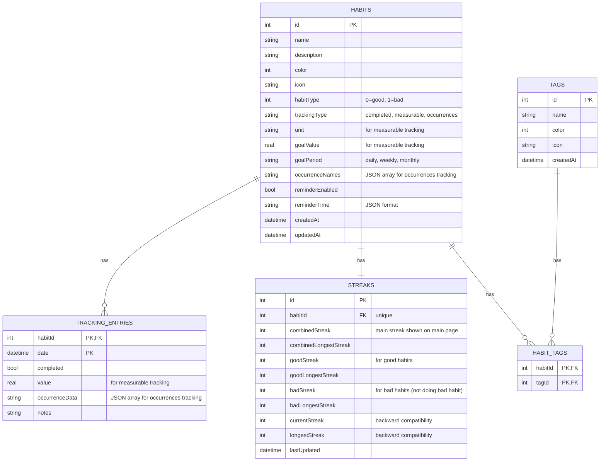

# Adati

<div align="center">

**A beautiful habit tracking app with timeline visualization**

[](https://creativecommons.org/licenses/by-nc-sa/4.0/)
[](https://flutter.dev)
[](https://dart.dev)
[](https://flutter.dev)

</div>

## 📱 About

Adati is a modern, feature-rich habit tracking application built with Flutter. It helps you build and maintain good habits through visual tracking, streak monitoring, and an intuitive timeline interface. The app supports multiple languages, themes, and runs seamlessly across all major platforms.

## ✨ Features

### Core Functionality
- **Habit Management**: Create, edit, and delete habits with custom names, descriptions, colors, and icons
- **Multiple Tracking Types**:
  - **Completed**: Simple yes/no tracking (e.g., "Meditated today")
  - **Measurable**: Track numeric values with units (e.g., "Walked 5 km", "Drank 8 glasses of water")
  - **Occurrences**: Track multiple occurrences per day (e.g., "Exercised: Morning, Evening")
- **Good & Bad Habits**: Track both positive habits you want to build and negative habits you want to break
- **Goal Setting**: Set daily, weekly, or monthly goals for measurable habits
- **Streak Tracking**: Automatic calculation and display of current and longest streaks (separate for good/bad habits)
- **Tag System**: Organize habits with custom tags for better categorization
- **Timeline Visualization**: Beautiful calendar grid showing your completion history at a glance
- **Day Details**: View and edit all entries for a specific date
- **Habit Details**: Comprehensive view of each habit with calendar modal, statistics, and management options
- **Reminders**: Set up daily reminders for your habits
- **Data Import/Export**: Import and export your data in JSON or CSV format

### User Experience
- **Material Design 3**: Modern, beautiful UI following Material Design principles
- **Dark & Light Themes**: System-aware theme with manual override option
- **Multi-language Support**: Currently supports English and Arabic (RTL support included)
- **Smooth Animations**: Polished transitions and loading states
- **Responsive Layout**: Optimized for phones, tablets, and desktop
- **Skeleton Loading**: Better perceived performance with skeleton screens

### Technical Features
- **Offline-First**: All data stored locally using SQLite
- **Database Migrations**: Seamless schema updates without data loss
- **Notifications**: Local notifications support (with permission handling)
- **Preferences**: Persistent user settings and preferences
- **Timezone Support**: Accurate date handling across timezones
- **Logging**: Comprehensive logging for debugging and error tracking
- **Desktop Mouse Support**: Custom scroll behavior enables mouse drag gestures on desktop platforms (Linux, Windows, macOS) for PageView and other scrollable widgets

### Platform Support
- ✅ Android
- ✅ iOS
- ✅ Linux
- ✅ macOS
- ✅ Windows
- ✅ Web

## 🚀 Getting Started

### Prerequisites

- Flutter SDK (3.9.2 or higher)
- Dart SDK (3.9.2 or higher)
- For platform-specific builds:
  - **Android**: Android Studio with Android SDK
  - **iOS**: Xcode (macOS only)
  - **Linux**: CMake and required development libraries
  - **Windows**: Visual Studio with C++ tools
  - **Web**: Chrome (for development)

### Installation

1. **Clone the repository**
   ```bash
   git clone https://github.com/Zyzto/Adati.git
   cd Adati
   ```

2. **Install dependencies**
   ```bash
   flutter pub get
   ```

3. **Generate code** (for Drift database)
   ```bash
   flutter pub run build_runner build
   ```

4. **Run the app**
   ```bash
   flutter run
   ```

### Building for Production

#### Android
```bash
flutter build apk --release --no-tree-shake-icons
# or for app bundle
flutter build appbundle --release --no-tree-shake-icons
```

#### iOS
```bash
flutter build ios --release
```

#### Linux
```bash
flutter build linux --release --no-tree-shake-icons
```

#### macOS
```bash
flutter build macos --release
```

#### Windows
```bash
flutter build windows --release --no-tree-shake-icons
```

#### Web
```bash
flutter build web --release
```

### Automated Releases

The project includes GitHub Actions workflows for automated builds and releases:

- **Automatic Release**: Push a tag (e.g., `v0.1.0`) to automatically build and release for Android, Linux, and Windows
- **Manual Trigger**: Use the "Run workflow" button in GitHub Actions to manually trigger builds
- **Artifacts**: Built apps are automatically uploaded to GitHub Releases

See `.github/workflows/release.yml` for the complete workflow configuration.

## 📖 Usage

### Creating a Habit
1. Navigate to the Timeline or Habits tab
2. Tap the "+" button or "New Habit" option
3. Enter habit name, optional description, choose a color and icon
4. Select habit type (Good or Bad habit)
5. Choose tracking type:
   - **Completed**: Simple completion tracking
   - **Measurable**: Set unit (minutes, km, glasses, etc.) and goal value
   - **Occurrences**: Define occurrence names (e.g., "Morning", "Evening")
6. Set goal period (daily, weekly, or monthly) for measurable habits
7. Optionally enable reminders and set reminder time
8. Add tags to organize your habits
9. Save to start tracking

### Tracking Habits

#### Completed Habits
- Tap on a day in the calendar grid to mark habits as complete/incomplete
- Add optional notes to any entry

#### Measurable Habits
- Tap on a day to enter a numeric value
- The app automatically marks as complete when goal is reached
- Track values like: minutes exercised, km walked, glasses of water, pages read, etc.

#### Occurrences Habits
- Tap on a day to select which occurrences happened
- Track multiple occurrences per day (e.g., "Exercised in the morning and evening")

### Viewing Timeline
- The main timeline shows a calendar grid with color-coded completion status
- Tap any day to view and edit all entries for that date
- Statistics at the top show your overall progress
- Filter habits by tags or search by name

### Habit Details
- Tap on any habit card to see:
  - Calendar view with completion history
  - Current and longest streaks
  - Statistics and progress
  - Edit or delete the habit

### Data Management
- **Export Data**: Export all data, habits only, or settings only (JSON or CSV format)
- **Import Data**: Import data from exported files (supports JSON and CSV)
- **Database Statistics**: View database size and record counts
- **Reset Habits**: Option to reset all habits and tracking data

### Settings
- **Language**: Switch between English and Arabic (with RTL support)
- **Theme**: Choose Light, Dark, or System theme
- **Data & Export**: Import/export your data
- **Advanced**: Database statistics and reset options
- All preferences are saved automatically

## 🖥️ Desktop-Specific Features

### Mouse Drag Support
The app includes a custom scroll behavior (`AppScrollBehavior`) that enables mouse drag gestures on desktop platforms. This allows users to:
- Click and hold to drag PageView slides (e.g., in the onboarding screen)
- Use mouse drag for all scrollable widgets throughout the app
- Support trackpad gestures

**Implementation**: The custom behavior extends `MaterialScrollBehavior` and includes `PointerDeviceKind.mouse` and `PointerDeviceKind.trackpad` in the allowed drag devices. This is applied globally via `MaterialApp.scrollBehavior`.

**Why it's needed**: Flutter's default `MaterialScrollBehavior` only allows drag gestures for touch devices, stylus, and inverted stylus. Without this custom behavior, users on desktop platforms cannot drag scrollable widgets with a mouse.

## 🏗️ Project Structure

```
lib/
├── main.dart                 # App entry point and initialization
├── app.dart                  # Main app widget and routing
│
├── core/                     # Core functionality
│   ├── database/            # Database models, DAOs, and connection
│   │   ├── models/          # Drift table definitions
│   │   ├── daos/            # Data Access Objects
│   │   └── app_database.dart
│   ├── services/            # App-wide services
│   │   ├── notification_service.dart
│   │   ├── preferences_service.dart
│   │   └── logging_service.dart
│   ├── theme/               # App theming
│   │   ├── app_theme.dart
│   │   └── app_scroll_behavior.dart  # Custom scroll behavior for desktop mouse support
│   └── utils/               # Utility functions
│
└── features/                 # Feature modules
    ├── habits/              # Habit management
    │   ├── habit_repository.dart  # Data layer (repository)
    │   ├── pages/           # Page widgets
    │   ├── providers/       # Riverpod providers
    │   └── widgets/         # Reusable widgets
    ├── timeline/            # Timeline visualization
    │   ├── pages/           # Timeline pages
    │   └── widgets/         # Timeline widgets
    ├── settings/            # Settings page
    │   ├── pages/           # Settings pages
    │   └── providers/       # Settings providers
    └── onboarding/          # Onboarding flow
        ├── pages/           # Onboarding pages
        └── widgets/         # Onboarding widgets
```

### 📚 Documentation

- **[SERVICES.md](SERVICES.md)** - Comprehensive documentation for all services in the codebase, including usage examples and API reference

## 🛠️ Technology Stack

- **Framework**: [Flutter](https://flutter.dev)
- **Language**: [Dart](https://dart.dev)
- **State Management**: [Riverpod](https://riverpod.dev)
- **Navigation**: [GoRouter](https://pub.dev/packages/go_router)
- **Database**: [Drift](https://drift.simonbinder.eu/) (SQLite ORM)
- **Localization**: [EasyLocalization](https://pub.dev/packages/easy_localization)
- **Notifications**: [flutter_local_notifications](https://pub.dev/packages/flutter_local_notifications)
- **UI Animations**: [animations](https://pub.dev/packages/animations)
- **Loading States**: [skeletonizer](https://pub.dev/packages/skeletonizer)
- **File Handling**: [file_picker](https://pub.dev/packages/file_picker) (for import/export)

## 🧪 Development

### Running Tests
```bash
flutter test
```

### Code Generation
When you modify database models or DAOs, regenerate the code:
```bash
flutter pub run build_runner build --delete-conflicting-outputs
```

### Generating Icons
After updating `assets/icon.png`, regenerate platform-specific icons:
```bash
flutter pub run flutter_launcher_icons
```

### Linting
The project uses `flutter_lints` for code quality:
```bash
flutter analyze
```

### Environment Variables
Create a `.env` file in the root directory for environment-specific configuration (optional):
```env
# Example .env file
DEBUG_MODE=true
```

### CI/CD
The project uses GitHub Actions for automated builds and releases:
- Workflow file: `.github/workflows/release.yml`
- Triggers on version tags (v*) or manual dispatch
- Builds for Android (APK/AAB), Linux (AppImage), and Windows (ZIP)
- Automatically creates GitHub releases with artifacts

## 📝 Database Schema

The app uses SQLite with the following main tables:
- **habits**: Stores habit information including:
  - Basic info: name, description, color, icon
  - Type: good (0) or bad (1) habit
  - Tracking type: completed, measurable, or occurrences
  - Measurable config: unit, goal value, goal period (daily/weekly/monthly)
  - Occurrences config: JSON array of occurrence names
  - Reminders: enabled flag and reminder time
- **tracking_entries**: Daily tracking records with:
  - Completion status (for completed habits)
  - Numeric value (for measurable habits)
  - Occurrence data as JSON array (for occurrences habits)
  - Optional notes
- **streaks**: Calculated streak data for each habit:
  - Combined streak (main display)
  - Good streak (for good habits)
  - Bad streak (for bad habits - days not doing the bad habit)
  - Longest streaks for each type
- **tags**: Habit tags for organization (name, color, icon)
- **habit_tags**: Junction table linking habits to tags (many-to-many relationship)

### Entity Relationship Diagram



## 🌍 Localization

Currently supported languages:
- English (en)
- Arabic (ar) - with RTL support

To add a new language:
1. Add translation files in `assets/translations/`
2. Update `main.dart` to include the new locale
3. Add language option in settings

## 🤝 Contributing

Contributions are welcome! Please feel free to submit a Pull Request. For major changes, please open an issue first to discuss what you would like to change.

1. Fork the repository
2. Create your feature branch (`git checkout -b feature/AmazingFeature`)
3. Commit your changes (`git commit -m 'Add some AmazingFeature'`)
4. Push to the branch (`git push origin feature/AmazingFeature`)
5. Open a Pull Request

## 📦 Download

Pre-built releases are available on [GitHub Releases](https://github.com/Zyzto/Adati/releases):

- **Android**: Download the APK file and install directly, or use the App Bundle for Google Play Store
- **Linux**: Download the AppImage, make it executable (`chmod +x adati-*.AppImage`), and run it
- **Windows**: Download the ZIP file, extract it, and run `adati.exe`

## 📄 License

This project is licensed under the Creative Commons Attribution-NonCommercial-ShareAlike 4.0 International License - see the [LICENSE](LICENSE) file for details.

**CC BY-NC-SA 4.0** means:
- ✅ You can share and adapt the code
- ✅ You must give appropriate credit
- ❌ You cannot use it for commercial purposes
- ✅ You must share adaptations under the same license

## 👤 Author

**Zyzto**

- GitHub: [@Zyzto](https://github.com/Zyzto)

## 🙏 Acknowledgments

- Built with [Flutter](https://flutter.dev)
- Icons and UI elements follow [Material Design](https://material.io/design)
- Database powered by [Drift](https://drift.simonbinder.eu/)

## 📞 Support

If you encounter any issues or have questions, please open an issue on GitHub.

---

<div align="center">

Made with ❤️ using Flutter

</div>
