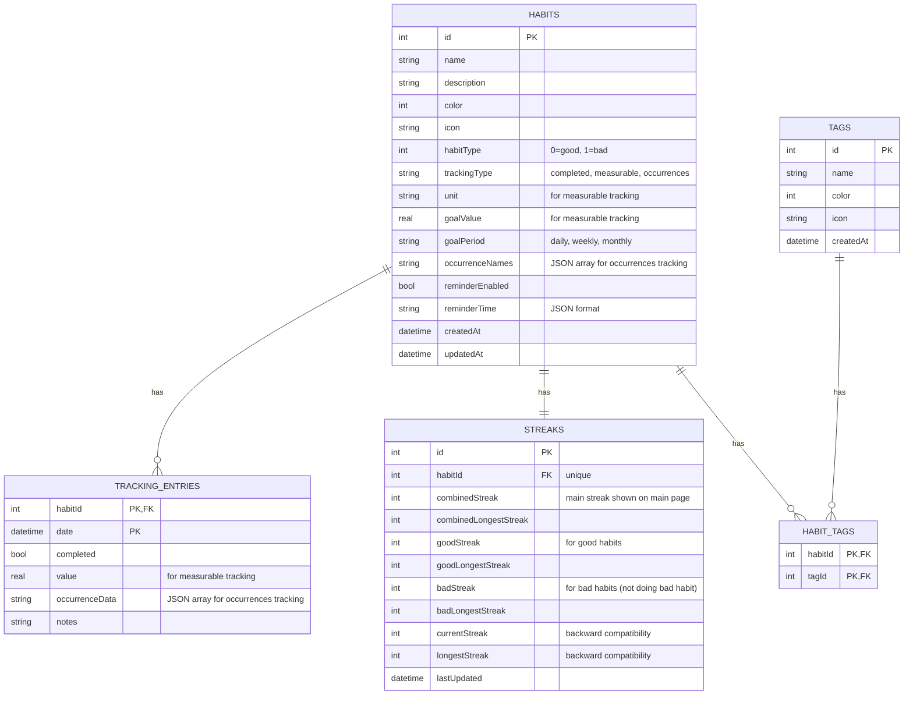

# Adati

<div align="center">

**A beautiful habit tracking app with timeline visualization**

[](https://creativecommons.org/licenses/by-nc-sa/4.0/)
[](https://flutter.dev)
[](https://dart.dev)

</div>

## 📱 About

Adati is a modern, feature-rich habit tracking application built with Flutter. It helps you build and maintain good habits through visual tracking, streak monitoring, and an intuitive timeline interface. The app supports multiple languages, themes, and runs seamlessly across all major platforms.

## ✨ Features

### Core Functionality
- **Habit Management**: Create, edit, and delete habits with custom names, descriptions, and colors
- **Daily Tracking**: Mark habits as complete/incomplete for any day with optional notes
- **Streak Tracking**: Automatic calculation and display of current and longest streaks
- **Category System**: Organize habits into categories for better management
- **Timeline Visualization**: Beautiful calendar grid showing your completion history at a glance
- **Day Details**: View and edit all entries for a specific date
- **Habit Details**: Comprehensive view of each habit with calendar modal and management options

### User Experience
- **Material Design 3**: Modern, beautiful UI following Material Design principles
- **Dark & Light Themes**: System-aware theme with manual override option
- **Multi-language Support**: Currently supports English and Arabic (RTL support included)
- **Smooth Animations**: Polished transitions and loading states
- **Responsive Layout**: Optimized for phones, tablets, and desktop
- **Skeleton Loading**: Better perceived performance with skeleton screens

### Technical Features
- **Offline-First**: All data stored locally using SQLite
- **Database Migrations**: Seamless schema updates without data loss
- **Notifications**: Local notifications support (with permission handling)
- **Preferences**: Persistent user settings and preferences
- **Timezone Support**: Accurate date handling across timezones
- **Logging**: Comprehensive logging for debugging and error tracking

### Platform Support
- ✅ Android
- ✅ iOS
- ✅ Linux
- ✅ macOS
- ✅ Windows
- ✅ Web

## 🚀 Getting Started

### Prerequisites

- Flutter SDK (3.9.2 or higher)
- Dart SDK (3.9.2 or higher)
- For platform-specific builds:
  - **Android**: Android Studio with Android SDK
  - **iOS**: Xcode (macOS only)
  - **Linux**: CMake and required development libraries
  - **Windows**: Visual Studio with C++ tools
  - **Web**: Chrome (for development)

### Installation

1. **Clone the repository**
   ```bash
   git clone https://github.com/Zyzto/Adati.git
   cd Adati
   ```

2. **Install dependencies**
   ```bash
   flutter pub get
   ```

3. **Generate code** (for Drift database)
   ```bash
   flutter pub run build_runner build
   ```

4. **Run the app**
   ```bash
   flutter run
   ```

### Building for Production

#### Android
```bash
flutter build apk --release
# or for app bundle
flutter build appbundle --release
```

#### iOS
```bash
flutter build ios --release
```

#### Linux
```bash
flutter build linux --release
```

#### macOS
```bash
flutter build macos --release
```

#### Windows
```bash
flutter build windows --release
```

#### Web
```bash
flutter build web --release
```

## 📖 Usage

### Creating a Habit
1. Navigate to the Timeline or Habits tab
2. Tap the "+" button or "New Habit" option
3. Enter habit name, optional description, and choose a color
4. Save to start tracking

### Tracking Habits
- **Daily Completion**: Tap on a day in the calendar grid to mark habits as complete
- **Notes**: Add notes to any tracking entry for additional context
- **View Details**: Tap on a habit card to see detailed statistics and calendar view

### Viewing Timeline
- The main timeline shows a calendar grid with color-coded completion status
- Tap any day to view and edit all entries for that date
- Statistics at the top show your overall progress

### Settings
- **Language**: Switch between English and Arabic
- **Theme**: Choose Light, Dark, or System theme
- All preferences are saved automatically

## 🏗️ Project Structure

```
lib/
├── main.dart                 # App entry point and initialization
├── app.dart                  # Main app widget and routing
│
├── core/                     # Core functionality
│   ├── database/            # Database models, DAOs, and connection
│   │   ├── models/          # Drift table definitions
│   │   ├── daos/            # Data Access Objects
│   │   └── app_database.dart
│   ├── services/            # App-wide services
│   │   ├── notification_service.dart
│   │   ├── preferences_service.dart
│   │   └── logging_service.dart
│   ├── theme/               # App theming
│   └── utils/               # Utility functions
│
└── features/                 # Feature modules
    ├── habits/              # Habit management
    │   ├── data/            # Data layer (repositories)
    │   ├── domain/          # Domain models
    │   └── presentation/    # UI (pages, widgets, providers)
    ├── timeline/            # Timeline visualization
    ├── tracking/            # Tracking logic
    ├── settings/            # Settings page
    └── main/                # Main shell/navigation
```

## 🛠️ Technology Stack

- **Framework**: [Flutter](https://flutter.dev)
- **Language**: [Dart](https://dart.dev)
- **State Management**: [Riverpod](https://riverpod.dev)
- **Navigation**: [GoRouter](https://pub.dev/packages/go_router)
- **Database**: [Drift](https://drift.simonbinder.eu/) (SQLite ORM)
- **Localization**: [EasyLocalization](https://pub.dev/packages/easy_localization)
- **Notifications**: [flutter_local_notifications](https://pub.dev/packages/flutter_local_notifications)
- **UI Animations**: [animations](https://pub.dev/packages/animations)
- **Loading States**: [skeletonizer](https://pub.dev/packages/skeletonizer)

## 🧪 Development

### Running Tests
```bash
flutter test
```

### Code Generation
When you modify database models or DAOs, regenerate the code:
```bash
flutter pub run build_runner build --delete-conflicting-outputs
```

### Linting
The project uses `flutter_lints` for code quality:
```bash
flutter analyze
```

### Environment Variables
Create a `.env` file in the root directory for environment-specific configuration (optional):
```env
# Example .env file
DEBUG_MODE=true
```

## 📝 Database Schema

The app uses SQLite with the following main tables:
- **habits**: Stores habit information (name, description, color, icon, type, tracking configuration)
- **tracking_entries**: Daily tracking records with completion status, values, and occurrence data
- **streaks**: Calculated streak data for each habit (combined, good, and bad streaks)
- **tags**: Habit tags for organization (many-to-many relationship)
- **habit_tags**: Junction table linking habits to tags

### Entity Relationship Diagram



## 🌍 Localization

Currently supported languages:
- English (en)
- Arabic (ar) - with RTL support

To add a new language:
1. Add translation files in `assets/translations/`
2. Update `main.dart` to include the new locale
3. Add language option in settings

## 🤝 Contributing

Contributions are welcome! Please feel free to submit a Pull Request. For major changes, please open an issue first to discuss what you would like to change.

1. Fork the repository
2. Create your feature branch (`git checkout -b feature/AmazingFeature`)
3. Commit your changes (`git commit -m 'Add some AmazingFeature'`)
4. Push to the branch (`git push origin feature/AmazingFeature`)
5. Open a Pull Request

## 📄 License

This project is licensed under the Creative Commons Attribution-NonCommercial-ShareAlike 4.0 International License - see the [LICENSE](LICENSE) file for details.

**CC BY-NC-SA 4.0** means:
- ✅ You can share and adapt the code
- ✅ You must give appropriate credit
- ❌ You cannot use it for commercial purposes
- ✅ You must share adaptations under the same license

## 👤 Author

**Zyzto**

- GitHub: [@Zyzto](https://github.com/Zyzto)

## 🙏 Acknowledgments

- Built with [Flutter](https://flutter.dev)
- Icons and UI elements follow [Material Design](https://material.io/design)
- Database powered by [Drift](https://drift.simonbinder.eu/)

## 📞 Support

If you encounter any issues or have questions, please open an issue on GitHub.

---

<div align="center">

Made with ❤️ using Flutter

</div>
